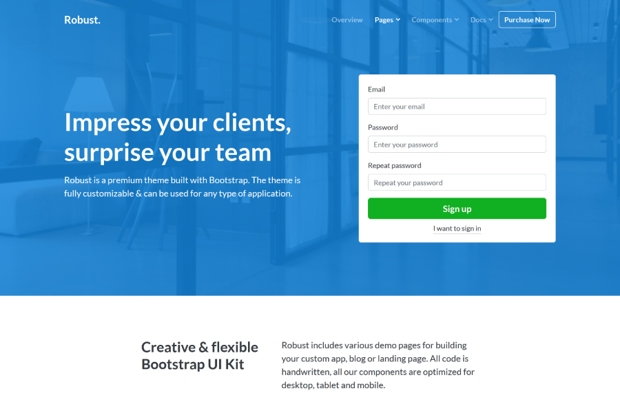

<!DOCTYPE html>
<html>
    <head>
    <meta charset="UTF-8">
    <meta name="site" content="zahra">
    <meta name="keywords" content="HTML, CSS">
    <meta name="zahra" content="zahra_amjad">
    <meta name="viewport" content="width=device-width, initial-scale=1.0">
    <title>new site</title>
    
    </head>
    <body>
        <nav class="bar">
            

                <a class="classaval" href="zahra.com" target="_top">zahra.</a>

            

                <ul>
            <li>
                <a class="nav-link" href="index.html">Overview</a>
            </li>
                    <li>
                        <a class="nav-link" href="index.html">page</a>
                    

                        <a href="https://robust.bootlab.io/pages-landing.html">Landing</a>
                        <a href="https://robust.bootlab.io/pages-dashboard.html">Dashboard</a>
                        <a href="https://robust.bootlab.io/pages-general.html">General</a>
                    

                    </li>
            <li>
                <a href="#">components</a>
                    

                        <a href="dropdown-item" href="https://robust.bootlab.io/components-bootstrap.html">Bootstrap</a>
                    <a href="https://robust.bootlab.io/components-robust.html">Robust</a>
                    

            </li>

                <li>
                    <a href="#">docs</a>
                    

                        <a class="dropdown-item" href="https://robust.bootlab.io/getting-started.html">Introduction</a>
                        <a class="dropdown-item" href="https://robust.bootlab.io/getting-started.html#quick-start">Quick start</a>
                        <a class="dropdown-item" href="https://robust.bootlab.io/getting-started.html#build-tools">Build tools</a>
                        <a class="dropdown-item" href="https://robust.bootlab.io/getting-started.html#contents">Contents</a>
                        <a class="dropdown-item" href="https://robust.bootlab.io/getting-started.html#changelog">Changelog</a>
                    

                </li>

                <button class="success"><b>Purchase Now</b></button>
                

                

                <h1 class="zahra">Robust UI Kit</h1>
                
<b>Robust is a premium theme built with Bootstrap. The theme is fully customizable & can be used for any type of application.</b>

                <button class="but2"><b>components</b></button>
                    <button class="but4">Getstarted</button>
             

            

        </nav>
            <min>
                

                    

                       

                          

                              

                              <h2>Discover our landing, app & blog pages</h2>
                              

                              

                                  
Robust includes various demo pages for building your custom app, blog or landing page. All code is handwritten, all our components are optimized for desktop, tablet and mobile.

                                  

                                    

                       

                    

                

                    

                        

                    

                    <h2>Landing</h2>
                    

                    Make your app look outstanding between the crowd using our wide variety of page components.
                    

                    

                    Explore Pages
                    

                    

                    

                    

                    

                    
                        <h2>Dashboard</h2>
                        

                            Create the best possible user experience for your customers using our app components.
                        

                        

                        Explore Pages
                        

                    

                    

                

                    

                    
                    <h2>Pages</h2>
                    

                        Discover our wide variety of pages including blog, about, contact and error pages.
                    

                    

                    Explore Pages
                    

                    

                

                

                

                    

                    

                        <h3>Multi-device support</h3>
                        

                            All pages inside Robust are optimized for mobile, tablet and desktop. It doesn't matter what device you're using.
                            
                        

                        

                    

                        <h3>Well-documented</h3>
                        

                        All Robust's components are well-documented and a Quick Start document is included to speed things up on your side
                        

                        

                        

                        <h3>3rd party plugins</h3>
                            

                            Robust comes with multiple 3rd party plugins that are easy to use and and combine well with other components.
                            

                        

                    

                       
                        

                    

                    

                        

                        

                        <h2>Enormous collection of elements</h2> 
                            

                            

                            

                                Robust is a premium theme built with Bootstrap 4, the most popular UI framework. The theme is fully responsive and customizable and can be used for any type of web application.
                                

                            

                        

                    

                

            

                

                    

                        

                        

                        

                            <h3>Responsive</h3>
                            
 With mobile, tablet & desktop support it doesn't matter what device you're using. Robust is responsive in all browsers.

                        

                    

                

                

                    

                        

                        

                        

                            <h3>Customizable</h3>
                            
You don't need to be an expert to customize Robust. Our code is very readable and well documented.

                        

                    

                

                

                    

                        

                            

                        

                            <h3>Quick support</h3>
                            
Robust is supported by specialists who provide quick and effective support. Usually an email reply takes <24h.

                        

                    

                

                

                    

                        

                        

                             

                                 <h3>Cross browser</h3>
                                 
Robust works perfectly with: Chrome, Firefox, Safari, Opera and IE 10+. We're working hard to support them.

                             

                    

                

                

                    

                         

                         

                        

                            <h3>Clean code</h3>
                            
We strictly followed Bootstrap's guidelines to make your integration as easy as possible. All code is handwritten.

                        

                    

                

                

                    

                        

                        

                        

                            <h3>Free updates</h3>
                            
From time to time you'll receive an update containing new components, improvements and bugfixes.

                        

                    

                

            

            

                

                    

                        

                            

                                

                                    
                                    <blockquote>
                                        “I can only recommend both this theme and the competent developer behind it to other people. Quick &amp; helpful sup
                                    </blockquote>
                                    Jane Roe
                                

                            

                        

                    

                

            

            

                

                    

                        

                            

                                

                                    
                                    <blockquote>
                                        “I can only recommend both this theme and the competent developer behind it to other people. Quick &amp; helpful sup
                                    </blockquote>
                                    John Roe
                                

                            

                        

                    

                

            

            

                

                    

                        

                            
                            <blockquote>
                                “I can only recommend both this theme and the competent developer behind it to other people. Quick &amp; helpful support!
                            </blockquote>
                            Jane Roe
                        

                    

                

            

            

                

                    

                        

                            

                                

                                    <h2>Integrates with all  your favorite tools</h2>
                                

                                

                                    
Robust uses industry standard build tools and plugins such as Sass, jQuery, Webpack, Babel and npm. All source files and compiled files are included inside the package.

                                

                            

                            

                                

                                    
                                

                                

                                    
                                

                                

                                    
                                

                                

                                    
                                

                                

                                    
                                

                                

                                    
                                

                            

                        

                    

                

            

            <footer>
                

                    

                        

                            <h3>Robust.</h3>
                        

                        

                            

                                

                                    <h4>Address</h4>
                                    <address>
                                        <ul >
                                            <li>
                                                City Hall 
                                                212  Street 
                                                Lawoma 
                                                735 
                                            </li>
                                        </ul>
                                    </address>
                                

        

    </body>
</html>
